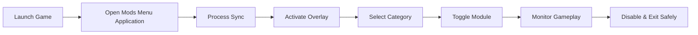

# Resident Evil Requiem Mods Menu

A structured **in-game modification interface application** designed for controlled single-player experimentation in Resident Evil Requiem.
This system delivers a layered runtime overlay that allows users to manage gameplay variables through categorized modules instead of fragmented scripts.

Unlike raw memory injectors, this Mods Menu Application introduces a controlled UI-driven management system built around session isolation, toggle logic, and profile-based execution.

---

## Why This Application Exists

Single-player survival titles often lock internal variables behind rigid mechanics. For users who want:

* Controlled experimentation
* Custom challenge balancing
* Tactical sandbox simulation
* Exploration without interruption

This mods menu creates a structured control layer that operates alongside the game process without altering installation files.

It focuses on **runtime modulation**, not permanent modification.

---

## Interface Structure 🧩

The menu is organized into layered navigation panels:

* **Player Control Panel**
* **Combat Adjustment Section**
* **Inventory & Resource Layer**
* **Environment & AI Controls**
* **Session Settings**

The UI supports:

* Keyboard navigation
* Controller-compatible navigation mapping
* Adjustable transparency
* Resizable overlay window
* High-contrast accessibility mode

[!NOTE]
The overlay does not inject graphical assets into the game engine. It operates as a separate UI layer bound to the process.

---

## Functional Modules Breakdown

### 🛡 Player Stability Module

* Health state lock
* Conditional invulnerability toggle
* Stamina consumption scaling
* Movement speed adjustment

### 🎯 Combat Precision Suite

* Recoil dampening logic
* Spread recalibration
* Rapid-fire parameter toggle
* Aim vector stabilization

### 🎒 Resource Governance Layer

* Ammo persistence rule
* Item duplication trigger
* Inventory capacity expansion
* Crafting cost override

### 🧠 Threat Management Controls

* Enemy freeze toggle
* Awareness radius scaling
* Spawn pacing modification
* AI delay adjustment

Each module functions independently, allowing minimal interference sessions.

---

## Runtime Interaction Flow



The flow ensures the application attaches after process confirmation and detaches cleanly before termination.

[!IMPORTANT]
Always wait until the main menu fully loads before activating the overlay to avoid offset misalignment.

---

## Configuration Profiles

Users can create preset configurations to match specific play styles.

Example preset: *Exploration Mode*

```
Player:
  HealthLock: false
  StaminaDrain: off
Combat:
  Recoil: normal
Environment:
  FreezeEnemies: true
Resources:
  AmmoFreeze: true
```

Example preset: *Balanced Hardcore*

```
Player:
  HealthLock: false
Combat:
  RecoilReduction: 20%
Environment:
  AwarenessBoost: +15%
Resources:
  NoFreeze
```

Profiles can be swapped during runtime without restarting the game session.

System Requirements:

* DirectX 11 compatible GPU
* 8GB RAM minimum
* Administrator privileges for process attach

---

## Safety & Session Integrity

The Mods Menu Application includes:

* Offset validation before activation
* Crash-detection auto-detach
* No file rewriting
* No persistent registry modification
* Temporary runtime memory adjustments only

[!WARNING]
This software is intended strictly for offline use. Do not enable modules in multiplayer or networked environments.

---

## Advanced Workflow Example

Scenario: Tactical Simulation Testing

1. Increase enemy awareness by 25%.
2. Disable ammo freeze.
3. Reduce recoil by 15%.
4. Slightly increase movement speed.

This configuration maintains pressure while smoothing mechanical friction.

Scenario: Cinematic Exploration

1. Freeze AI behavior.
2. Disable stamina drain.
3. Increase movement speed.
4. Disable combat modifications.

This setup allows uninterrupted environmental observation.

---

## Performance Footprint

The application operates with:

* ~50MB RAM usage
* Minimal CPU spikes during toggling
* No background scanning loops
* Event-based activation triggers

Because it uses targeted memory resolution rather than brute-force scanning, it reduces system strain and instability risk.

---

## Frequently Asked Questions

### Does this change the game permanently?

No. All changes revert when the session ends.

### Can I bind custom hotkeys?

Yes. Every function supports customizable keyboard mapping.

### Is an internet connection required?

No. The application runs completely offline.

### Will it work after future updates?

Game patches may require offset adjustments. Updated builds are provided after compatibility verification.

### Does it interfere with Windows security?

It requires administrator access but does not disable or modify Windows Defender settings.

---

## Update Philosophy

The development model follows:

* Controlled offset revision
* Windows build verification
* Structured module testing
* Version-based compatibility tracking

Users are encouraged to match application version with current game build for stability.

---

## Closing Summary

Resident Evil Requiem Mods Menu Application offers a structured, UI-driven runtime control environment for Windows users seeking gameplay customization in single-player sessions.

It emphasizes:

* Session safety
* Modular control
* Accessibility support
* Stable attach/detach lifecycle

Designed for clarity and controlled experimentation, it provides a layered interface rather than fragmented memory scripts.

---

